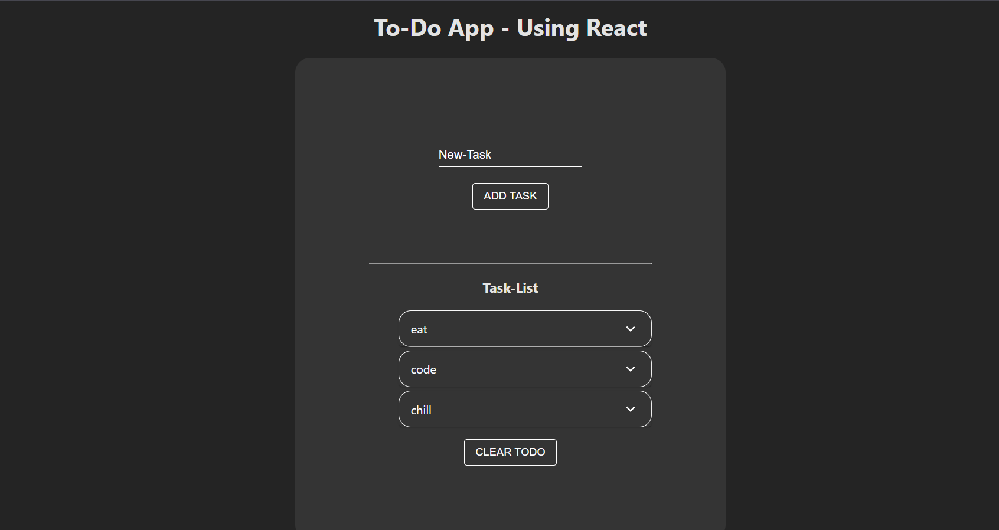

# To-Do App (React, Node.js, Express, MongoDB)

This is a simple, full-stack To-Do application built with React for the frontend, Node.js and Express for the backend, and MongoDB as the database. The app supports all CRUD (Create, Read, Update, Delete) operations to manage your to-do tasks.

## Features
- **Create** new tasks
- **Read** tasks from the database
- **Update** task statuses (completed or pending)
- **Delete** tasks
- Fully functional and interactive UI built with React
- Backend powered by Node.js and Express
- Data stored in MongoDB

## Tech Stack
- **Frontend**: React.js
- **Backend**: Node.js, Express.js
- **Database**: MongoDB
- **Others**: Axios (for making HTTP requests)

## Clone the Repository

To clone this repository, run the following command in your terminal:

```bash
git clone https://github.com/vishwas2628/To-Do-React.git
```

## Installation

Follow these steps to set up the app locally on your machine.

### 1. Clone the repository

```bash
git clone https://github.com/vishwas2628/To-Do-React.git
cd To-Do-React
```

### 2. Install dependencies for both frontend and backend

#### For Backend (Node.js + Express):
Navigate to the backend directory and install the dependencies:

```bash
cd backend
npm install
```

#### For Frontend (React):
Navigate to the frontend directory and install the dependencies:

```bash
cd ../frontend
npm install
```

### 3. Set up MongoDB

Make sure you have MongoDB installed and running locally or use a cloud MongoDB service like [MongoDB Atlas](https://www.mongodb.com/cloud/atlas).

In the backend directory, create a `.env` file and set the MongoDB URI:

```
MONGO_URI=your_mongodb_connection_string
```

### 4. Start the Application

#### For Backend (Express):
Go to the backend directory and run:

```bash
cd backend
npm start
```

#### For Frontend (React):
Go to the frontend directory and run:

```bash
cd frontend
npm start
```

The app should now be live on [http://localhost:8080](http://localhost:8080).

## Usage

Once the app is running, you can:
- Add tasks by typing in the input box and pressing Enter.
- Mark tasks as completed or pending.
- Delete tasks when they are no longer needed.
- All changes will be saved to the MongoDB database.

## Screenshots

Here is a screenshot of the To-Do app in action:



*(You can upload a screenshot image and replace the URL with the correct path to your image.)*

## License

This project is open-source and available under the [MIT License](LICENSE).

---
